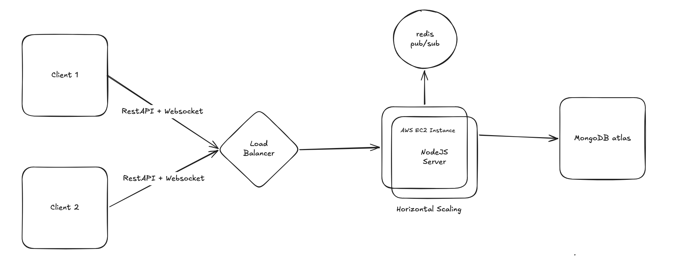
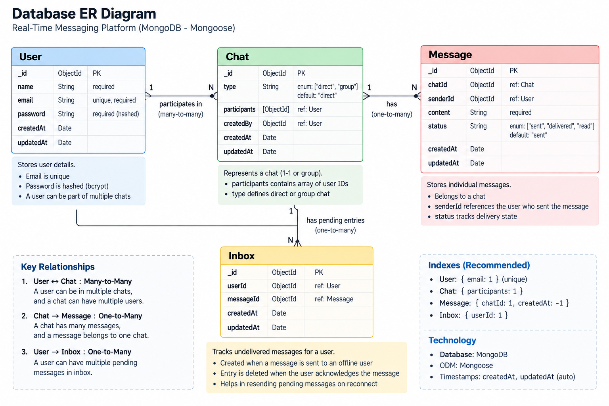

# Scalable Real-Time Messaging Platform

A backend-focused, real-time messaging platform built with **Node.js,
Express, WebSockets, MongoDB Atlas, Redis Pub/Sub, Docker, and AWS
EC2**. The project is designed around reliable message delivery, offline
message handling, horizontal scaling, and low-latency real-time
communication.

> **Project status:** Deployed on AWS EC2 and containerized with Docker.
> Redis Pub/Sub is used to support message delivery across horizontally
> scaled Node.js instances.

------------------------------------------------------------------------

## Table of Contents

-   [Overview](#overview)
-   [Key Features](#key-features)
-   [Tech Stack](#tech-stack)
-   [Architecture](#architecture)
-   [How the System Works](#how-the-system-works)
-   [Database Design](#database-design)
-   [REST API](#rest-api)
-   [WebSocket Communication](#websocket-communication)
-   [Message Delivery Flow](#message-delivery-flow)
-   [Offline Message Delivery](#offline-message-delivery)
-   [Redis Pub/Sub and Horizontal
    Scaling](#redis-pubsub-and-horizontal-scaling)
-   [Reliability and Delivery
    Guarantees](#reliability-and-delivery-guarantees)
-   [Security](#security)
-   [Docker](#docker)
-   [AWS Deployment](#aws-deployment)
-   [Environment Variables](#environment-variables)
-   [Running Locally](#running-locally)
-   [Running with Docker](#running-with-docker)
-   [Project Structure](#project-structure)
-   [Design Decisions](#design-decisions)
-   [Known Scope / Limitations](#known-scope--limitations)
-   [License](#license)

------------------------------------------------------------------------

## Overview

This project implements the backend of a WhatsApp-style real-time
messaging system.

The core design separates:

-   **REST APIs** for authentication, chat management, and
    message-history/pending-message retrieval.
-   **WebSockets** for persistent, bidirectional real-time
    communication.
-   **MongoDB Atlas** for durable storage of users, chats, messages, and
    pending inbox entries.
-   **Redis Pub/Sub** for routing messages between multiple Node.js
    server instances.
-   **Docker** for reproducible application packaging.
-   **AWS EC2** for deployment and runtime hosting.

The main engineering goal is to make message delivery reliable even when
a recipient is temporarily disconnected and to allow the backend to
scale horizontally.

------------------------------------------------------------------------

## Key Features

-   JWT-based authentication.
-   One-to-one real-time messaging.
-   WebSocket-based persistent connections.
-   MongoDB message persistence.
-   Message history retrieval.
-   `sent` / `delivered` / `read` message states.
-   Offline message persistence using an Inbox collection.
-   Automatic resend of pending messages when a user reconnects.
-   Message acknowledgment flow.
-   Online connection tracking.
-   Redis Pub/Sub for cross-instance message routing.
-   Dockerized backend.
-   AWS EC2 deployment.
-   Architecture designed for horizontal scaling behind a load balancer.

------------------------------------------------------------------------

## Tech Stack

  Layer                       Technology
  --------------------------- -------------------
  Runtime                     Node.js
  HTTP API                    Express.js
  Real-time communication     WebSockets (`ws`)
  Authentication              JWT
  Password hashing            bcrypt
  Database                    MongoDB Atlas
  ODM                         Mongoose
  Distributed messaging       Redis Pub/Sub
  Containerization            Docker
  Cloud deployment            AWS EC2
  API validation              express-validator
  Environment configuration   dotenv
  HTTP client                 Axios

------------------------------------------------------------------------

# Architecture




### Architecture Explanation

1.  Clients communicate with the backend through REST APIs and
    persistent WebSocket connections.
2.  A load balancer distributes incoming traffic across multiple Node.js
    server instances.
3.  Each Node.js instance handles HTTP requests and WebSocket
    connections.
4.  MongoDB Atlas provides centralized durable storage for users, chats,
    messages, and pending inbox entries.
5.  Redis Pub/Sub allows one Node.js instance to deliver a message to a
    recipient connected to another instance.
6.  The architecture therefore separates **durable state** (MongoDB),
    **real-time communication** (WebSockets), and **cross-instance
    routing** (Redis).

> The load balancer is important for horizontal scaling, while Redis
> prevents a message from being limited to the Node.js process that
> originally received it.

------------------------------------------------------------------------

# How the System Works

## 1. User Authentication

A user registers and logs in through the REST API.

The backend:

1.  Validates the request.
2.  Hashes passwords using bcrypt during registration.
3.  Verifies credentials during login.
4.  Generates a JWT.
5.  The client uses the JWT for authenticated requests/connections.

------------------------------------------------------------------------

## 2. WebSocket Connection

After authentication, the client establishes a WebSocket connection.

The WebSocket layer maintains an in-memory mapping similar to:

``` text
userId → WebSocket connection
```

This allows the server to determine whether a recipient is connected to
the current Node.js instance.

------------------------------------------------------------------------

## 3. Sending a Message

When a sender sends a message:

``` text
Client
   ↓
WebSocket
   ↓
Node.js Server
   ↓
Create Message in MongoDB
   ↓
Create Inbox entry for recipient
   ↓
Is recipient connected locally?
      ├── YES → Send directly through WebSocket
      └── NO  → Publish to Redis channel
```

The message is persisted before delivery is attempted so that temporary
connection failures do not immediately result in message loss.

------------------------------------------------------------------------

# Database Design

The application uses MongoDB Atlas with four core collections.





## User

Stores authentication and user information.

Main fields:

``` text
_id
name
email
password
createdAt
updatedAt
```

## Chat

Represents a conversation and its participants.

Main fields:

``` text
_id
type
participants
createdBy
createdAt
updatedAt
```

`type` supports the chat model used by the project, including
direct/group conversation semantics.

## Message

Stores the actual message.

Main fields:

``` text
_id
chatId
senderId
content
status
createdAt
updatedAt
```

Message status is represented by:

``` text
sent
delivered
read
```

## Inbox

The Inbox collection acts as the pending-delivery mechanism.

Main fields:

``` text
_id
userId
messageId
createdAt
updatedAt
```

When a recipient is unavailable, an Inbox record keeps track of the
message that still needs to be delivered.

After the recipient acknowledges delivery, the corresponding Inbox
record is removed.

------------------------------------------------------------------------

# REST API

> The REST layer handles authentication, chat operations, and retrieval
> operations. Real-time message transmission is handled by WebSockets
> rather than repeatedly polling an HTTP endpoint.

## Authentication

  -----------------------------------------------------------------------
  Method                  Endpoint                Description
  ----------------------- ----------------------- -----------------------
  `POST`                  `/api/auth/register`    Creates a new user
                                                  account.

  `POST`                  `/api/auth/login`       Validates credentials
                                                  and returns a JWT.
  -----------------------------------------------------------------------

## Chat

  -----------------------------------------------------------------------
  Method                  Endpoint                Description
  ----------------------- ----------------------- -----------------------
  `GET`                   `/api/chats`            Retrieves chats
                                                  available to the
                                                  authenticated user.

  `POST`                  `/api/chats/direct`     Creates or retrieves a
                                                  one-to-one chat between
                                                  users.
  -----------------------------------------------------------------------

## Messages

  -------------------------------------------------------------------------
  Method                  Endpoint                  Description
  ----------------------- ------------------------- -----------------------
  `GET`                   `/api/messages/:chatId`   Retrieves message
                                                    history for a chat.

  -------------------------------------------------------------------------

## Inbox

  -----------------------------------------------------------------------
  Method                  Endpoint                Description
  ----------------------- ----------------------- -----------------------
  `GET`                   `/api/inbox`            Retrieves pending
                                                  messages waiting for
                                                  the authenticated user.

  -----------------------------------------------------------------------

### API Authentication

Protected endpoints require a valid JWT.

Conceptually:

``` text
Authorization: Bearer <JWT>
```

------------------------------------------------------------------------

# WebSocket Communication

WebSockets are used for persistent, bidirectional communication.

The important message/event types used by the messaging flow are:

  -----------------------------------------------------------------------
  Direction               Event / Type            Description
  ----------------------- ----------------------- -----------------------
  Client → Server         `sendMessage`           Requests delivery of a
                                                  new message.

  Server → Client         `newMessage`            Delivers a new message
                                                  to the recipient.

  Client → Server         `acknowledgeMessage`    Confirms that the
                                                  recipient received the
                                                  message.
  -----------------------------------------------------------------------

### Typical message flow

``` text
Sender Client
     |
     | sendMessage
     ↓
Node.js Server
     |
     | MongoDB persistence
     |
     | local delivery OR Redis Pub/Sub
     ↓
Recipient Client
     |
     | acknowledgeMessage
     ↓
Node.js Server
     |
     | remove Inbox entry
     | update message status
     ↓
MongoDB
```

> The exact JSON payload should be kept synchronized with the WebSocket
> handler implementation in the repository.

------------------------------------------------------------------------

# Message Delivery Flow

The delivery mechanism is intentionally designed around persistence plus
acknowledgment.

### Step 1 --- Create message

The server creates a `Message` document with:

``` text
status = "sent"
```

### Step 2 --- Create pending Inbox entry

An Inbox entry is created for each recipient.

### Step 3 --- Attempt real-time delivery

The server checks whether the recipient is connected to the current
Node.js instance.

### Step 4 --- Local delivery

If the recipient is connected locally:

``` text
Node.js → WebSocket → Recipient
```

### Step 5 --- Cross-instance delivery

If the recipient is not connected locally, the server publishes the
message to the recipient's Redis channel:

``` text
user:<recipientId>
```

Another Node.js instance subscribed to that channel can deliver the
message through its local WebSocket connection.

### Step 6 --- Acknowledgment

The recipient sends an acknowledgment.

The server then:

``` text
Delete Inbox entry
Update message status → delivered
```

This prevents a successfully delivered message from remaining
indefinitely in the pending queue.

------------------------------------------------------------------------

# Offline Message Delivery

Offline delivery is handled through the `Inbox` collection.

Example:

``` text
Alice → sends message → Bob
                         |
                         | Bob offline
                         ↓
                    Message stored
                         +
                    Inbox entry
```

When Bob reconnects:

``` text
Bob reconnects
      ↓
Server finds pending Inbox entries
      ↓
Resends pending messages
      ↓
Bob acknowledges
      ↓
Inbox entry deleted
```

This gives the application a persistent pending-delivery mechanism
instead of relying only on an active WebSocket connection.

------------------------------------------------------------------------

# Redis Pub/Sub and Horizontal Scaling

A single WebSocket server has an important limitation:

``` text
Alice ──→ Server A
Bob   ──→ Server B
```

Server A cannot directly access Bob's WebSocket connection because Bob
is connected to Server B.

Redis Pub/Sub solves this:

``` text
Alice
  ↓
Server A
  ↓
Redis channel: user:<bobId>
  ↓
Server B
  ↓
Bob's WebSocket
```

Each server can publish messages to recipient-specific channels and
subscribe to the channels required for cross-instance delivery.

This makes the WebSocket layer compatible with horizontal scaling.

------------------------------------------------------------------------

# Reliability and Delivery Guarantees

The project uses several mechanisms to improve reliability:

### Persistent message storage

Messages are stored in MongoDB rather than existing only in WebSocket
memory.

### Pending Inbox

An Inbox record represents a message that still requires delivery
confirmation.

### Acknowledgment

The Inbox entry is removed after the recipient acknowledges delivery.

### Reconnection handling

Pending messages can be retrieved/resubmitted when the user reconnects.

### Redis cross-instance routing

Redis allows messages to reach users connected to a different Node.js
instance.

### Centralized database

MongoDB Atlas provides shared durable state across application
instances.

------------------------------------------------------------------------

# Security

The project includes:

-   JWT-based authentication.
-   Password hashing with bcrypt.
-   Authentication middleware for protected APIs.
-   Request validation using `express-validator`.
-   Environment variables for secrets and configuration.
-   CORS configuration.
-   WebSocket authentication/authorization through the application's
    authentication flow.

### Production security direction

For production deployment, the WebSocket endpoint should be exposed
through secure transport:

``` text
HTTPS
WSS
```

with TLS termination handled at the load-balancer/reverse-proxy layer.

------------------------------------------------------------------------

# Docker

The application is containerized so that the same application artifact
can be run locally or deployed to a cloud VM.

Docker Hub image:

**`anasnevrekar/real-time-messaging-platform`**

``` bash
docker pull anasnevrekar/real-time-messaging-platform
```

Run the image:

``` bash
docker run --env-file .env -p 3000:3000 anasnevrekar/real-time-messaging-platform
```

> Adjust the exposed port if the application is configured to listen on
> a different port.

Docker Hub repository:

http://hub.docker.com/r/anasnevrekar/real-time-messaging-platform

Docker Hub is used as the container registry for distributing the
application image.

------------------------------------------------------------------------

# AWS Deployment

The application has been deployed on an **AWS EC2 instance** using the
Dockerized Node.js backend.

High-level deployment flow:

``` text
Developer
    ↓
GitHub
    ↓
Docker image
    ↓
Docker Hub
    ↓
AWS EC2
    ↓
Container
    ↓
Node.js Application
```

For the horizontally scaled architecture:

``` text
Clients
   ↓
Load Balancer
   ↓
┌───────────────┬───────────────┐
│ Node.js #1    │ Node.js #2    │
└───────────────┴───────────────┘
          ↕
      Redis Pub/Sub
          ↕
      MongoDB Atlas
```

------------------------------------------------------------------------

# Environment Variables

Create a `.env` file locally.

Example structure:

``` env
PORT=3000
MONGO_URI=<your-mongodb-atlas-uri>
JWT_SECRET=<your-jwt-secret>
REDIS_URL=<your-redis-url>
NODE_ENV=development
```

Do not commit real secrets to Git.

A `.env.example` file should contain variable names without credentials.

------------------------------------------------------------------------

# Running Locally

## Prerequisites

Install:

-   Node.js
-   npm
-   MongoDB Atlas account/database
-   Redis instance
-   Git

## 1. Clone the repository

``` bash
git clone <YOUR_GITHUB_REPOSITORY_URL>
cd scalable-real-time-messaging-platform
```

## 2. Install dependencies

``` bash
npm install
```

## 3. Configure environment variables

``` bash
cp .env.example .env
```

Fill in the required values.

## 4. Start the server

Development:

``` bash
npm run dev
```

Production:

``` bash
npm start
```

The server should then expose the configured HTTP/WebSocket port.

------------------------------------------------------------------------

# Running with Docker

Build the image locally:

``` bash
docker build -t real-time-messaging-platform .
```

Run it:

``` bash
docker run --env-file .env -p 3000:3000 real-time-messaging-platform
```

Or pull the published image:

``` bash
docker pull anasnevrekar/real-time-messaging-platform
```

Then run:

``` bash
docker run --env-file .env -p 3000:3000 anasnevrekar/real-time-messaging-platform
```

------------------------------------------------------------------------

# Project Structure

A simplified project structure:

``` text
scalable-real-time-messaging-platform/
│
├── Dockerfile
├── .dockerignore
├── .env.example
├── package.json
│
├── .github/
│   └── workflows/
│       └── deploy.yml
│
└── src/
    ├── server.js
    │
    ├── config/
    │   ├── db.js
    │   └── redis.js
    │
    ├── controllers/
    │
    ├── middleware/
    │
    ├── models/
    │   ├── User.js
    │   ├── Chat.js
    │   ├── Message.js
    │   └── Inbox.js
    │
    ├── routes/
    │
    ├── services/
    │   ├── chat.service.js
    │   ├── inbox.service.js
    │   └── message.service.js
    │
    ├── utils/
    │
    └── websocket/
        └── websocket.server.js
```

### Separation of responsibilities

``` text
Routes
  ↓
Controllers
  ↓
Services
  ↓
Models / Database
```

The service layer contains the main business logic, while the WebSocket
layer handles real-time communication.

------------------------------------------------------------------------

# Design Decisions

## Why WebSockets?

Polling would require clients to repeatedly ask the server whether a new
message exists.

WebSockets maintain a persistent connection, allowing the server to push
messages immediately.

## Why MongoDB?

The messaging domain contains flexible documents such as users, chats,
messages, and inbox records. MongoDB provides document-oriented
persistence suitable for this model.

## Why Redis Pub/Sub?

A WebSocket connection belongs to a specific Node.js process. Redis
Pub/Sub provides a communication layer between multiple
processes/instances.

## Why an Inbox collection?

A WebSocket connection is temporary. The Inbox provides a durable
pending-delivery mechanism so a temporary disconnect does not
immediately lose a message.

## Why Docker?

Docker packages the application and its runtime environment consistently
for local development and cloud deployment.

## Why AWS EC2?

EC2 provides a straightforward deployment target for the Dockerized
backend and allows the architecture to evolve from a single instance
toward multiple horizontally scaled instances.

------------------------------------------------------------------------

# Known Scope / Limitations

This project is an MVP focused on backend engineering and distributed
real-time messaging concepts.

Current scope emphasizes:

-   1-to-1 messaging.
-   Authentication.
-   Persistence.
-   Offline delivery.
-   Delivery acknowledgment.
-   Redis-based cross-instance routing.
-   Docker and AWS deployment.


------------------------------------------------------------------------

# License

This project is intended as a portfolio and engineering project.
